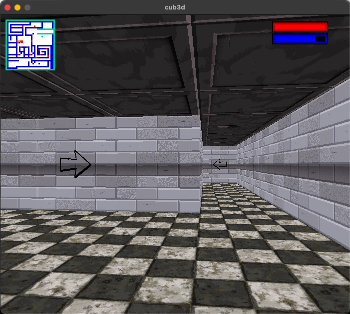

<h1 align="center">Cub3D</h1>
<h3 align="center">A wolfenstein like made in C from scratch with the minilib X</h3>

 - Little preview

<h6>  Installation : ⚠️ works only on macOSX</h6>

make && ./Cub3D ./maps/[map_file]

<h6>  Controls :</h6>

   - WASD to move

   - ESC to quit

   - <- & -> to turn the camera

- 🌱 Made at 42

